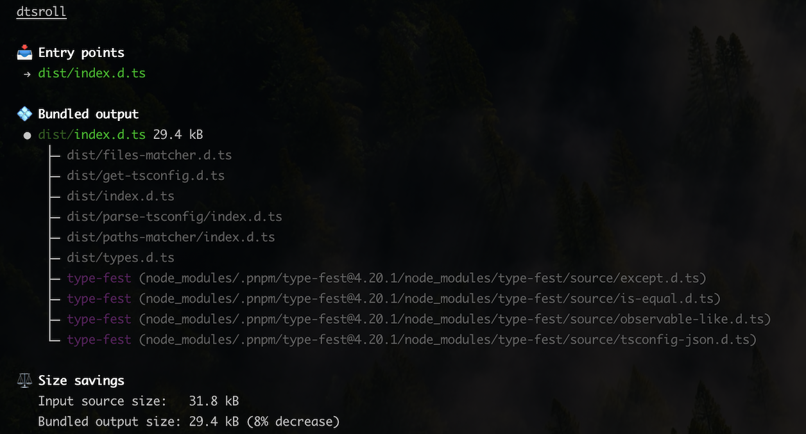

<p align="center">
  
</p>
<h2 align="center">dtsroll</h2>

Are you publishing a TypeScript project where consumers encounter type-checking errors like:

```
Cannot find module 'some-package' or its corresponding type declarations.
```

When you compile with `tsc`, the emitted declaration files (`.d.ts` files) preserve imports exactly as written. So if your published types import from a `devDependency` or a private package (e.g. an internal monorepo package), those imports cannot be resolved by the consumer.

```ts
// dist/index.d.ts (generated by tsc)
import type { SomeType } from 'my-private-dependency' // ❌ consumers can't resolve this

export declare function myUtility(): SomeType
```

If you can't move the dependency to `dependencies`, or you just want its types pulled directly into your published declarations, _dtsroll_ is for you.

## What is dtsroll?

_dtsroll_ is a TypeScript declaration (`.d.ts`) file bundler. It's zero-config and reads your `package.json` to determine how your types should be bundled.

### What dtsroll does

_dtsroll_ runs *after your build when `.d.ts` files have been emitted*, and works in-place to bundle them to their entry points.

Since packages declared in `devDependencies` are not installed for the consumer, _dtsroll_ assumes any imports referencing them should be bundled, as they would otherwise be unresolvable.

The result is a single, clean `.d.ts` output that works for consumers without extra installs.

```ts
// dist/index.d.ts (after dtsroll)
type SomeType = {
    value: string
}

export declare function myUtility(): SomeType
```

### Features

- **Zero config** — Automatically finds entry points from `package.json`.
- **Fixes missing-type errors** — Inlines types from `devDependencies` so consumers don't need them installed.
- **Tree-shaken output** — Unused types are removed to keep files small.
- **In-place** — Designed to run directly on your `dist` folder after compilation.

<p align="center">
  
</p>

## Install

```bash
npm install --save-dev dtsroll
```

## Quick start

### 1. Configure `package.json`

Point your `types` or `exports` to the final `.d.ts` file you want to publish.

```jsonc
{
	"name": "my-package",
	"exports": {
		"types": "./dist/index.d.ts", // dtsroll targets this
		"default": "./dist/index.js",
	},
	"scripts": {
		"build": "tsc && dtsroll",
	},
}
```

### 2. Build

```bash
npm run build
```

That's it.

> [!WARNING]
> _dtsroll_ modifies files in-place—bundled source files are removed and entry files are overwritten with bundled output.
> Use `--dry-run` first to see what it would change:
>
> ```bash
> dtsroll --dry-run
> ```

## Behavior

### Automatic configuration

By default, _dtsroll_ reads your `package.json` to determine which imports should be bundled and which should remain external. The recommended setup is to run _dtsroll_ without any configuration and let it infer the correct behavior based on your dependency declarations.

| Dependency type        | Action      | Reason                        |
| ---------------------- | ----------- | ----------------------------- |
| `devDependencies`      | Bundle      | Consumers don't install these |
| `dependencies`         | Externalize | Consumers already have them   |
| `optionalDependencies` | Externalize | Consumers already have them   |
| `peerDependencies`     | Externalize | Provided by the consumer      |

If you have a `@types/*` package in `devDependencies` but the corresponding runtime package in `dependencies`, _dtsroll_ will recommend moving the types package to `dependencies`, as this can otherwise result in missing types for consumers.

### Manual configuration

If your project doesn't have a `package.json` file, you can still manually specify the input files (which entry files to collapse the `imports` into), and which packages to externalize.

### Subpath imports

> [!WARNING]
> Currently, _dtsroll_ mistakenly resolves and bundles [subpath imports](https://nodejs.org/api/packages.html#subpath-imports). Subpath imports are intended to be dynamic aliases controlled by the consumer. In a future breaking release, _dtsroll_ will likely externalize them to preserve this behavior.

## Usage

_dtsroll_ can be used in several ways.

### CLI usage

```bash
dtsroll [flags] [...entry .d.ts files]
```

If no entry files are provided, _dtsroll_ reads `package.json` to determine them.

#### Flags

| Flag           | Alias | Description                                       |
| -------------- | ----- | ------------------------------------------------- |
| `--dry-run`    | `-d`  | Show what would be bundled without writing files  |
| `--conditions` | `-C`  | Resolution conditions for [subpath exports](https://nodejs.org/api/packages.html#subpath-exports) (e.g. `production`)         |
| `--external`   | `-e`  | *(Only when no `package.json`)* Packages to externalize |

### Vite plugin

If you use `vite-plugin-dts`, _dtsroll_ will automatically bundle the emitted types immediately after generation:

```ts
import { defineConfig } from 'vitest/config'
import dts from 'vite-plugin-dts'
import { dtsroll } from 'dtsroll/vite'

export default defineConfig({
    plugins: [
        dts(),
        dtsroll()
    ]
})
```

### Node API

```ts
import { dtsroll } from 'dtsroll'

await dtsroll({
    cwd: process.cwd(),
    dryRun: false
})
```

## Related

- [pkgroll](https://github.com/privatenumber/pkgroll) — Zero-config JS + DTS bundler
